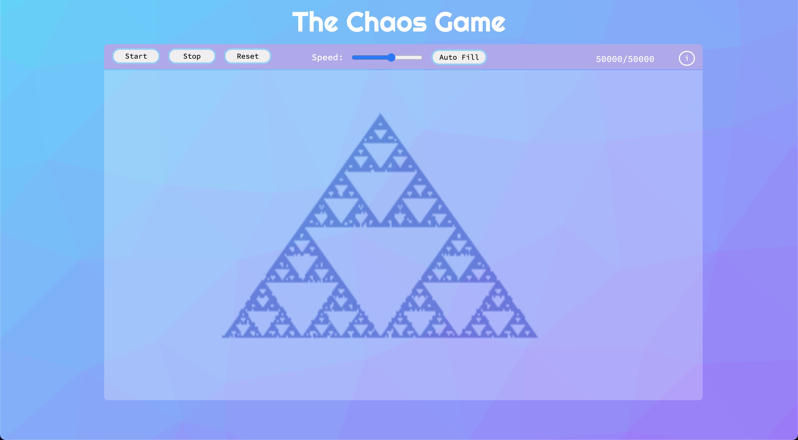

## The Chaos Game 
The Chaos Game is a method to create fractals using random number generation. 
First, a random starting point is chosen.
For each subsequent turn, a random number is generated to chose a vertex of the polygon.
A point is then placed halfway between the starting point and the chosen vertex.
The process is repeated many times starting from each newly placed point.

This simulation allows the process to be automated and viewed in real time at variable speeds. 
Support for more fractal types coming soon!
